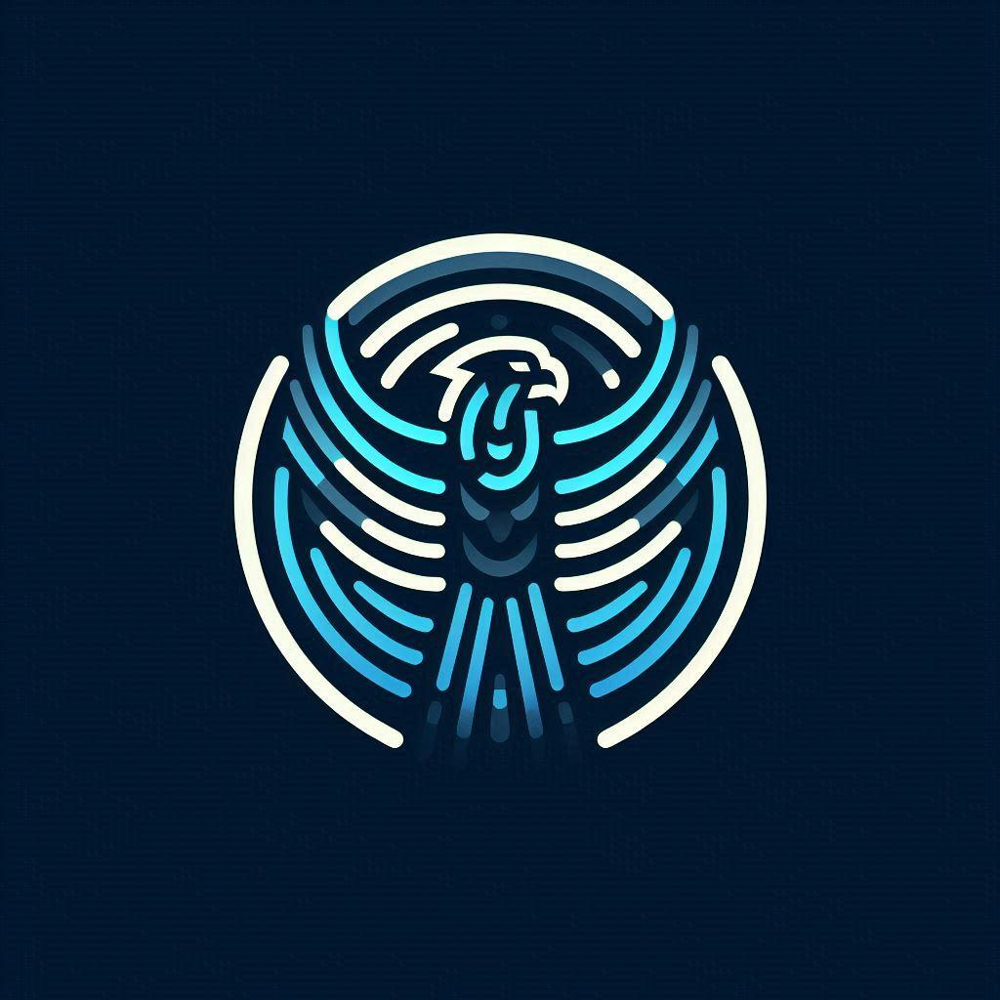

# The Eagle Project

Eagle is an OCR engine written in C++ and using Tesseract, and OpenCV.

## Getting Started
### Building
```bash
git glone https://github.com/renemuala/eagle # clone a fresh copy of the repository
xmake # build the project
```

### Running
```bash
xmake run eagle fake/path/picture.jpeg # run the project
```

## License
This project is licensed under the MIT License - see the [LICENSE](LICENSE) file for details.
